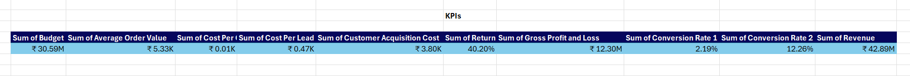
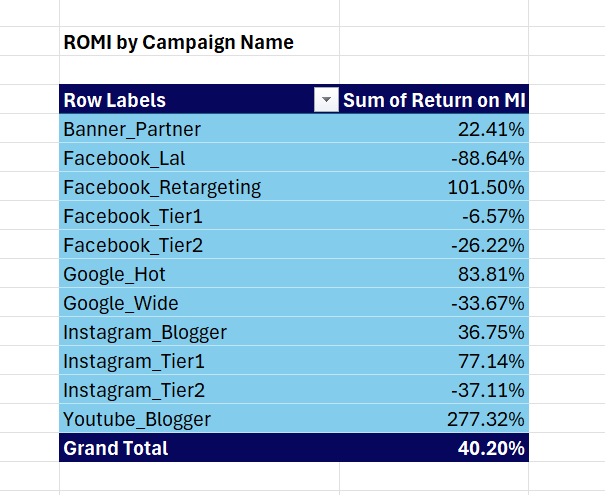
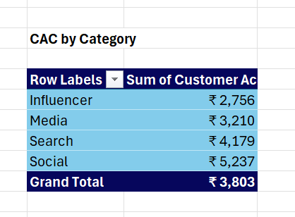
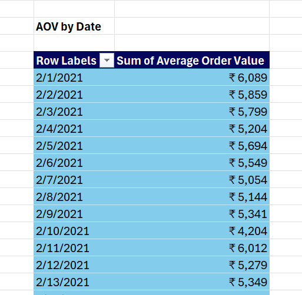
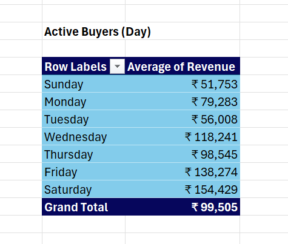
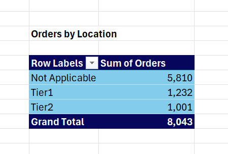
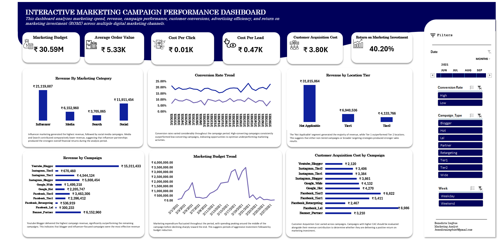

# Marketing Spend & ROMI Analysis

An Excel marketing analytics project evaluating an 11-campaign marketing budget across social, search, influencer, and media (banner) channels over February 2021 — using Return on Marketing Investment (ROMI) and a full KPI funnel to answer six business questions, with pivot tables and an interactive dashboard.

**File:** [`Marketing_Dataset.xlsx`](./Marketing_Dataset.xlsx)

 [Marketing ROMI Analysis Report](Marketing_ROMI_Analysis/REPORT_README.md)

---

## About the Dataset

308 rows of daily campaign-level marketing data (11 campaigns × 28 days, Feb 1–28, 2021): `Date`, `Campaign_Name`, `Category`, `Campaign_Id`, `Impressions`, `Market_Budget`, `Clicks`, `Leads`, `Orders`, `Revenue`.

---

## Steps Taken

### 1. Data Cleaning & Feature Engineering (`Working Data` tab)
Built out the raw data into an Excel Table (`Table1`) with derived columns needed for the analysis:
- **`Day`** — day of week (`TEXT(Date,"dddd")`)
- **`Week`** — Weekday/Weekend flag (`IF(WEEKDAY(Date,2)>5,"Weekend","Weekday")`)
- **`Campaign_Type`** — the campaign's sub-type, extracted from the text after the underscore in `Campaign_Name` (`TEXTAFTER`), e.g. `Facebook_Tier1` → `Tier1`
- **`Location`** — geo-tier flag (`Tier1` / `Tier2` / `Not Applicable`), parsed by searching `Campaign_Name` for "Tier1"/"Tier2" — since only 4 of the 11 campaigns (`Facebook_Tier1/2`, `Instagram_Tier1/2`) actually carry geo-tier targeting

### 2. KPI Calculation (row level)
Added a full KPI column set to every row, matching the brief's definitions exactly: **CTR, Conversion 1, Conversion 2, AOV, CPC, CPL, CAC, ROMI, Gross Profit/Loss** — plus **Conversion 1 (Grouped)** and **Conversion 2 (Grouped)** columns that bucket each row as "High"/"Low" against a 2% and 15% threshold, for the High/Low breakdown used later in the pivots. All ratio columns are wrapped in `IFERROR(...,0)` to handle rows with zero orders or leads.

### 3. Pivot Table Layer (`PivotTables and PivotCharts` tab)
20 pivot tables built off `Working Data`, covering:
- A headline **KPI summary block** (Total Budget, AOV, CPC, CPL, CAC, ROMI, Gross Profit and Loss, Conversion Rates 1 and 2, Revenue)

---



---

- **ROMI by Campaign, by Category, by Location(tier)**

---



---

- **CAC by Campaign, by Category, by Location**

---



---

- **Revenue, Budget, and Orders trends by Date**, plus **AOV by Date** and a **Conversion Rate by Date** crosstab (split by High/Low)

---



---

- **Active Buyers by Day-of-Week and by Weekday/Weekend** (average revenue)

---



---

- **Revenue, Orders, and Budget broken out by Campaign, Category, and Location**

---



---

A **slicer** (Campaign_Type / Conversion Rate 2 grouping / Week) and a **Date timeline** sit on the dashboard for interactive filtering.

> **A methodology fix made during this write-up:** several of the ratio-based pivots (ROMI, CAC, AOV) were originally built as `Sum of ROMI`, `Sum of CAC`, etc. — a pivot table calculated field defined as `SUM(ROMI)`. That adds up the *per-row* ratio across every campaign-day rather than recalculating the ratio from the summed totals, which inflates the numbers (the original Grand Total showed "ROMI" as 12,554%, which isn't a real return figure). The calculated field formulas were corrected to compute from aggregated totals instead — e.g. `Return on MI` is now `(SUM(Revenue)-SUM(Market_Budget))/SUM(Market_Budget)`, `Customer Acquisition Cost` is `SUM(Market_Budget)/SUM(Orders)`, and so on for AOV, CPC, CPL, and Conversion Rate 1/2. The pivots that were already summing an additive dollar column (Revenue, Budget, Orders) or averaging revenue directly needed no change.

### 4. Dashboard (`Dashboard` tab)
Six charts pulling live from the pivot tables:
- Revenue by Marketing Category
- Revenue by Campaign
- Marketing Budget Trend (by date)
- Conversion Rate Trend (Conversion 1 & 2, by date)
- Customer Acquisition Cost by Campaign
- Revenue by Location Tier

Plus the slicer and date timeline for interactive filtering across every chart on the sheet.

---



---

## Business Questions & Answers

### 1. Overall ROMI
**Total Spend:** ₹30,590,879.82 · **Total Revenue:** ₹42,889,366 · **Gross Profit:** ₹12,298,486.18
**Overall ROMI: 40.2%** — every rupee spent returned ₹1.40, on average.

### 2. ROMI by Campaign
| Campaign | ROMI | CAC (₹) |
|---|---|---|
| Youtube_Blogger | **+277.3%** | 2,120 |
| Facebook_Retargeting | +101.5% | 2,467 |
| Google_Hot | +83.8% | 4,270 |
| Instagram_Tier1 | +77.1% | 3,384 |
| Instagram_Blogger | +36.8% | 3,861 |
| Banner_Partner | +22.4% | 3,210 |
| Facebook_Tier1 | −6.6% | 5,411 |
| Facebook_Tier2 | −26.2% | 6,822 |
| Google_Wide | −33.7% | 4,132 |
| Instagram_Tier2 | −37.1% | 3,406 |
| Facebook_Lal | **−88.6%** | 8,986 |

`Youtube_Blogger` is the standout; `Facebook_Lal` (lookalike audiences) is losing money on nearly every rupee spent.

### 3. Performance by Date
- **Biggest spend day:** Feb 20 (₹3,499,171.70) — also the **biggest revenue day** (₹5,261,521), so the heaviest spend day paid off.
- **Highest Conversion 1 (visitor → lead):** Feb 10 (2.83%). **Lowest:** Feb 2 (1.29%).
- **Highest Conversion 2 (lead → sale):** Feb 25 (15.04%). **Lowest:** Feb 18 (8.95%), notably a high-spend day — a sign lead quality or sales follow-up didn't scale with the extra volume.
- **Highest AOV:** Feb 26 (₹6,282.84). **Lowest AOV:** Feb 10 (₹4,203.95) — interestingly the same day as the best Conversion 1, suggesting that day pulled in a higher volume of lower-value orders.
- **Average order value across the month:** ₹5,332.51.

### 4. Buyer Activity: Weekday vs. Weekend
Per the `Active Buyers` pivots (average revenue per campaign-day):

| | Avg. revenue |
|---|---|
| Weekday | ₹141,914.24 |
| Weekend | ₹132,593.56 |

Weekdays edge out weekends, but the day-of-week breakdown tells the real story:

| Day | Avg. revenue |
|---|---|
| Friday | ₹217,594.89 |
| Saturday | ₹193,713.68 |
| Wednesday | ₹158,495.34 |
| Thursday | ₹135,362.98 |
| Tuesday | ₹103,125.80 |
| Monday | ₹94,992.20 |
| Sunday | ₹71,473.43 |

Buyers are most active **Friday and Saturday** — Saturday, technically a "weekend" day, actually outperforms every weekday except Friday, which the weekday/weekend split alone hides. **Sunday is the weakest day by a wide margin.**

### 5. Best-Performing Category
| Category | ROMI | CAC (₹) |
|---|---|---|
| Influencer | **+154.3%** | 2,756 |
| Media (banner) | +22.4% | 3,210 |
| Search | +7.1% | 4,179 |
| Social | **−13.7%** | 5,237 |

Influencer marketing is the clear leader; Social — the largest spend line at 45% of the total budget (₹13.8M) — is the only category running at a net loss.

### 6. Geo Targeting: Tier 1 vs. Tier 2
| Location | ROMI | CAC (₹) |
|---|---|---|
| Not Applicable* | +61.5% | 3,391 |
| Tier 1 | +35.3% | 4,164 |
| Tier 2 | **−28.2%** | 5,754 |

*"Not Applicable" = the 7 campaigns without geo-tier targeting (Youtube_Blogger, Instagram_Blogger, Facebook_Retargeting, Facebook_Lal, Google_Hot, Google_Wide, Banner_Partner).

Among the four campaigns that do carry geo-tier targeting, **Tier 1 clearly outperforms Tier 2** — but the bigger finding is that the non-geo-targeted campaigns as a group outperform both tiers, largely on the strength of `Youtube_Blogger` and `Facebook_Retargeting`.

---

## Recommendations

1. **Shift budget away from `Facebook_Lal` (−88.6% ROMI) and Tier 2 social targeting**, toward `Youtube_Blogger` and `Facebook_Retargeting`, which post the highest ROMI and lowest CAC in the dataset.
2. **Audit the Social category as a whole.** It's the largest spend line (45% of budget) but the only category running at a net loss — worth reviewing targeting and creative before cutting further.
3. **Favor Tier 1 over Tier 2 geo-targeting** wherever a campaign supports it; Tier 2 is currently destroying value on both Facebook and Instagram.
4. **Concentrate incremental spend around Friday and Saturday**, where revenue consistently peaks, and pull back on Sunday.
5. **Investigate the Feb 18 conversion dip** — spend scaled up but lead-to-sale conversion hit its monthly low, suggesting sales/follow-up capacity may not keep pace with lead volume on high-spend days.
6. **`Facebook_Retargeting` is under-invested relative to its ROMI** (101.5% ROMI on one of the smallest budgets in the dataset) — a strong candidate to scale up and test.

## Conclusion

The overall campaign portfolio is profitable (40.2% ROMI), but that number hides a wide spread: influencer marketing and retargeting are strongly profitable, while broad social prospecting — especially lookalike audiences and Tier 2 geo-targeting — is losing money. Reallocating budget toward the proven channels, tightening Tier 2 targeting, and timing spend around the Friday–Saturday peak are the clearest levers to raise blended ROMI without increasing total spend.

---

## Tools Used
- **Microsoft Excel** — Excel Tables, formula-driven KPI columns, 20 PivotTables/PivotCharts, slicers, a date timeline, and a chart-based dashboard
- Every KPI (ROMI, CPC, CPL, CAC, AOV, CTR, Conversion 1, Conversion 2) is calculated live from formulas and pivot calculated fields — no hardcoded results


## Repository Structure
```
Marketing-Campaign-Performance-Analytics
│
├── README.md
├── Marketing_Dataset.xlsx
│
└── Marketing_ROMI_Analysis
    ├── REPORT_README.md
    └── Marketing_ROMI_Analysis.pdf
---

## Author's Note
This project was created to demonstrate my ability to analyze marketing data using Excel, transform raw data into meaningful insights, and evaluate campaign performance through key marketing KPIs such as ROMI, conversion rates, CAC, CPC, CPL, and AOV.
— Benedicta Izegbue | Data Analyst

---

- LinkedIn Profile https://www.linkedin.com/in/benedicta-izegbue-b42198385/
- X Profile https://x.com/dicta_andy?s=21


